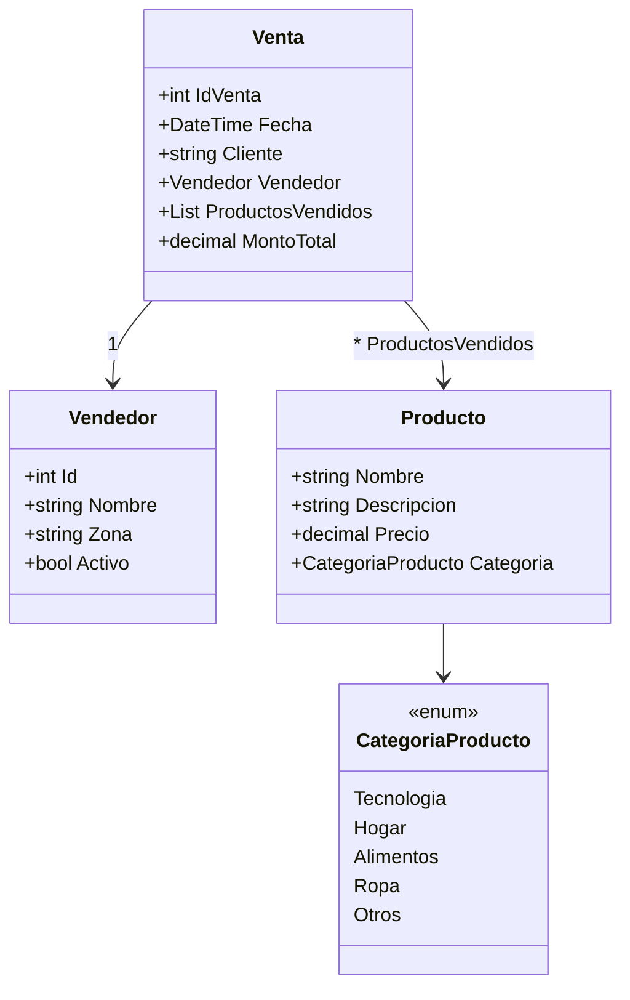
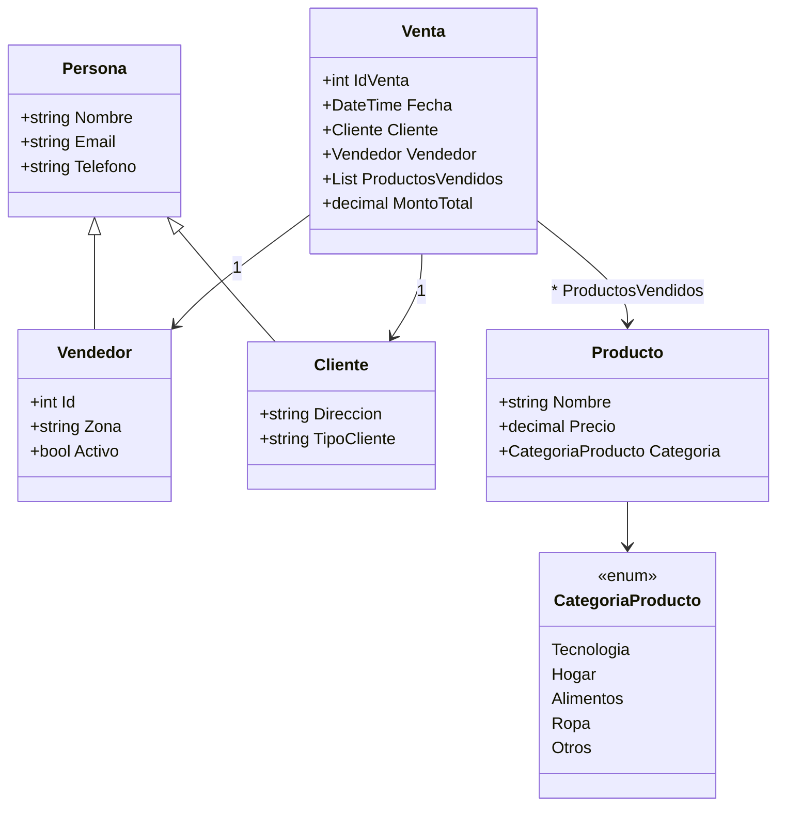
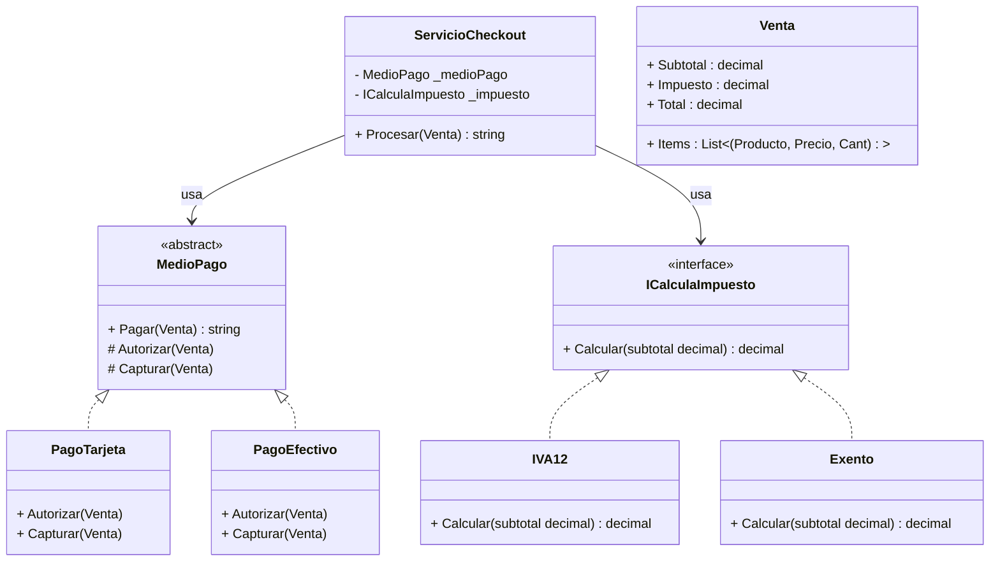

# 💼 POO aplicado al Sistema de Ventas (con UML)

Este documento parte del **Sistema de Ventas v1.0** y lo evoluciona hacia los 4 pilares de POO, incluyendo **diagramas UML en Mermaid** para documentación en Notion/GitHub.

---

## 🚀 Sistema de Ventas – Versión 1.0 (caso base)

```csharp
Console.WriteLine("Sistema de Ventas ----------  Version 1.0!");

//-------------- Creación de Productos -----------------
// Producto Laptop
var laptop = new Producto();
laptop.Nombre = "Laptop Dell XPS";
laptop.Descripcion = "Laptop ultrabook de 13 pulgadas";
laptop.Precio = 1200.50M;
laptop.Categoria = CategoriaProducto.Tecnologia;

// Producto Celular
var celular = new Producto();
celular.Nombre = "iPhone 15";
celular.Descripcion = "Smartphone de última generación";
celular.Precio = 1500.00M;
celular.Categoria = CategoriaProducto.Tecnologia;

//-------------- Creación de Vendedor ------------------
var vendedor = new Vendedor();
vendedor.Id = 1;
vendedor.Nombre = "Carlos Pérez";
vendedor.Zona = "Ciudad Capital";
vendedor.Activo = true;

//-------------- Registro de Ventas --------------------
var venta1 = new Venta();
venta1.IdVenta = 1001;
venta1.Fecha = DateTime.Now;
venta1.Cliente = "Empresa ABC";
venta1.Vendedor = vendedor;
venta1.ProductosVendidos = new List<Producto>();
venta1.ProductosVendidos.Add(laptop);
venta1.MontoTotal = laptop.Precio;

var venta2 = new Venta();
venta2.IdVenta = 1002;
venta2.Fecha = DateTime.Now;
venta2.Cliente = "Cliente Individual Juan López";
venta2.Vendedor = vendedor;
venta2.ProductosVendidos = new List<Producto>();
venta2.ProductosVendidos.Add(celular);
venta2.MontoTotal = celular.Precio;

//-------------- Imprimir Resultados -------------------
Console.WriteLine($"Vendedor: {vendedor.Nombre}, Zona: {vendedor.Zona}");
Console.WriteLine($"Venta 1 -> Cliente: {venta1.Cliente}, Monto: {venta1.MontoTotal}, Producto: {venta1.ProductosVendidos[0].Nombre}");
Console.WriteLine($"Venta 2 -> Cliente: {venta2.Cliente}, Monto: {venta2.MontoTotal}, Producto: {venta2.ProductosVendidos[0].Nombre}");

//--------------- Clases Principales --------------------
class Vendedor
{
    public int Id;
    public string Nombre;
    public string Zona;
    public bool Activo;
}

class Producto
{
    public string Nombre;
    public string Descripcion;
    public decimal Precio;
    public CategoriaProducto Categoria;
}

class Venta
{
    public int IdVenta;
    public DateTime Fecha;
    public string Cliente;
    public Vendedor Vendedor;
    public List<Producto> ProductosVendidos;
    public decimal MontoTotal;
}

// Enum para clasificar productos
enum CategoriaProducto
{
    Tecnologia,
    Hogar,
    Alimentos,
    Ropa,
    Otros
}
```

### 📊 UML (Mermaid) – Modelo base


---

## 👨‍👩‍👦 Herencia
- Clase base **Persona**: Nombre, Email, Teléfono.  
- **Vendedor** hereda de Persona: Id, Zona, Activo.  
- **Cliente** hereda de Persona: Dirección, TipoCliente.  
- **Venta** relaciona Vendedor + Cliente + Productos.

### 📊 UML (Mermaid) – Herencia


---

## 🔐 Encapsulamiento (ideas clave)
- Campos privados + **propiedades con `private set`**.  
- Validaciones en **constructor** y **setters**.  
- Colecciones expuestas como `IReadOnlyList`.  
- Métodos controlan cambios de estado (`DescontarStock`).

*(Ver ejemplo de código completo en la sección previa de nuestra conversación.)*

---

## 🧩 Abstracción (Checkout con medios de pago)
- Clase abstracta **MedioPago** define el *qué* (`Pagar`, `Autorizar`, `Capturar`).  
- **PagoTarjeta** y **PagoEfectivo** implementan el *cómo*.  
- Interface **ICalculaImpuesto** permite estrategias (IVA, Exento).  
- **ServicioCheckout** depende de contratos, no implementaciones.

### 📊 UML (Mermaid) – Abstracción


---

## 🎭 Polimorfismo
- Una misma llamada se comporta distinto según el objeto real.  
- Ejemplo: `List<MedioPago>` con **PagoTarjeta, PagoEfectivo, PagoTransferencia**.  
- **Checkout** procesa con distintas estrategias de impuestos.  
- Extensible: agregar **PagoCrypto** sin tocar el cliente.

*(Ver demo en el PPT y el snippet de la sección de polimorfismo.)*

---

## ✨ Resumen Final
- **Herencia** → Reutilizamos código.  
- **Encapsulamiento** → Protegemos estado.  
- **Abstracción** → Definimos contratos.  
- **Polimorfismo** → Múltiples comportamientos.  

👉 Así modelamos sistemas **flexibles, claros y mantenibles**.
