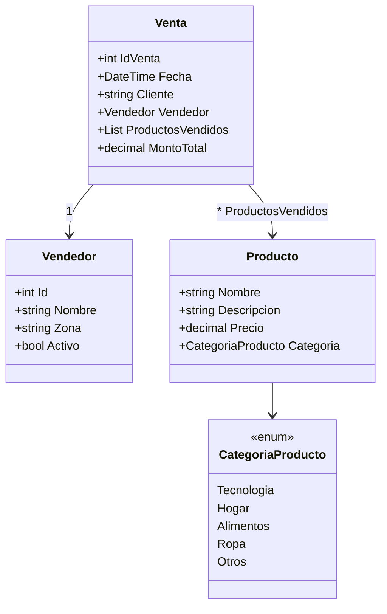
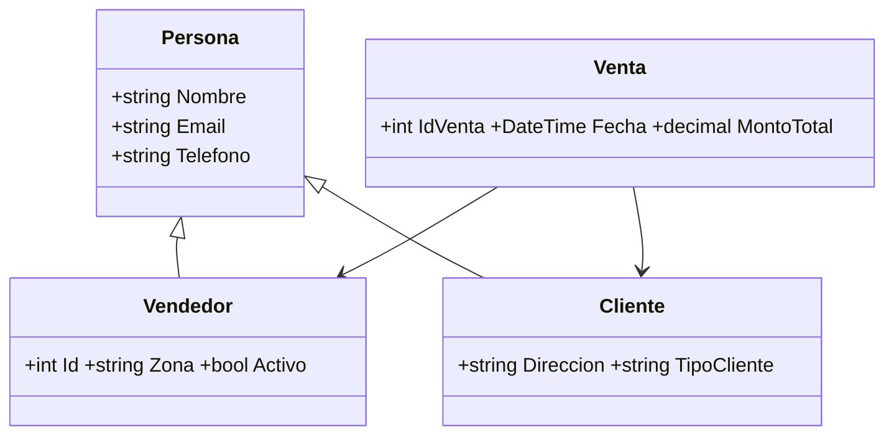
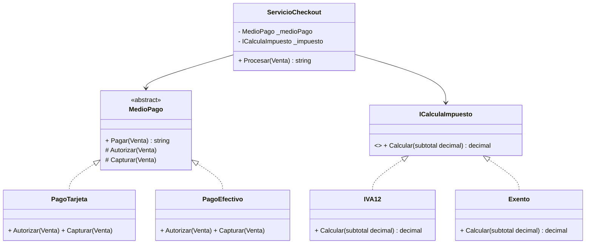
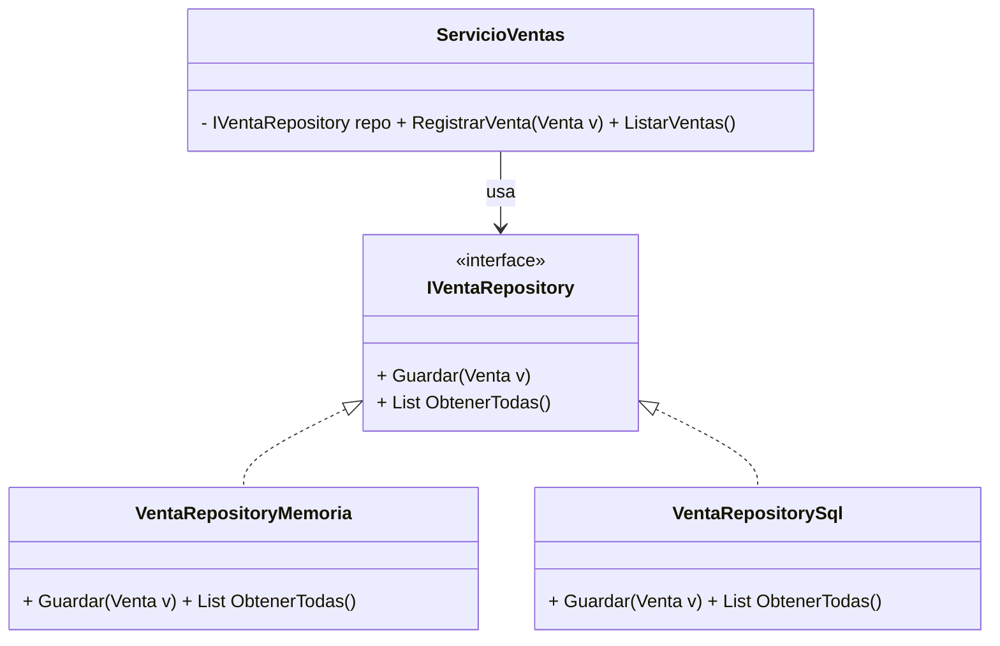

# 💼 POO aplicado al Sistema de Ventas (con UML + Interfaces)

Este documento parte del **Sistema de Ventas v1.0** y lo evoluciona hacia los 4 pilares de POO más **Interfaces**, incluyendo **diagramas UML en Mermaid**.

---

## 🚀 Sistema de Ventas – Versión 1.0 (caso base)
*(igual que antes, ver código inicial de ventas con Vendedor, Producto, Venta y Enum)*

### 📊 UML (Mermaid) – Modelo base


---

## 👨‍👩‍👦 Herencia
- Clase base **Persona**: Nombre, Email, Teléfono.  
- **Vendedor** hereda de Persona.  
- **Cliente** hereda de Persona.  
- **Venta** relaciona Vendedor + Cliente + Productos.

### 📊 UML (Mermaid) – Herencia


---

## 🔐 Encapsulamiento
- Campos privados + **propiedades con `private set`**.  
- Validaciones en constructor y setters.  
- Colecciones como `IReadOnlyList`.  
- Métodos que controlan estado (`DescontarStock`).

---

## 🧩 Abstracción
- Clase abstracta **MedioPago** define contrato (`Pagar`).  
- **PagoTarjeta**, **PagoEfectivo** implementan el detalle.  
- Interface **ICalculaImpuesto** permite estrategias (IVA, Exento).  
- **ServicioCheckout** depende de abstracciones, no implementaciones.

### 📊 UML (Mermaid) – Abstracción


---

## 🎭 Polimorfismo
- Una misma llamada → distintos resultados según el objeto.  
- Ejemplo: `List<MedioPago>` con varias implementaciones.  
- Extensible: añadir `PagoCrypto` sin tocar `Checkout`.

---

## 🔌 Interfaces
Las **interfaces** definen contratos que las clases deben cumplir.  
Ejemplo: un repositorio de ventas con diferentes implementaciones.

### Código
```csharp
// Contrato
public interface IVentaRepository {
    void Guardar(Venta venta);
    List<Venta> ObtenerTodas();
}

// Implementación en memoria
public class VentaRepositoryMemoria : IVentaRepository {
    private readonly List<Venta> _ventas = new();
    public void Guardar(Venta venta) => _ventas.Add(venta);
    public List<Venta> ObtenerTodas() => _ventas;
}

// Implementación en SQL (simulada)
public class VentaRepositorySql : IVentaRepository {
    public void Guardar(Venta venta) => Console.WriteLine($"[SQL] Guardada venta {venta.IdVenta}");
    public List<Venta> ObtenerTodas() { Console.WriteLine("[SQL] Consultando..."); return new List<Venta>(); }
}

// Servicio que usa cualquier repositorio
public class ServicioVentas {
    private readonly IVentaRepository _repo;
    public ServicioVentas(IVentaRepository repo) => _repo = repo;
    public void RegistrarVenta(Venta v) => _repo.Guardar(v);
    public void ListarVentas() => _repo.ObtenerTodas().ForEach(v => Console.WriteLine(v.IdVenta));
}
```

### 📊 UML (Mermaid) – Interface Repository


---

## ✨ Resumen Final
- **Herencia** → Reutilización de código.  
- **Encapsulamiento** → Protección de estado.  
- **Abstracción** → Contratos generales.  
- **Polimorfismo** → Distintos comportamientos.  
- **Interfaces** → Desacoplamiento total, código flexible y mantenible.
