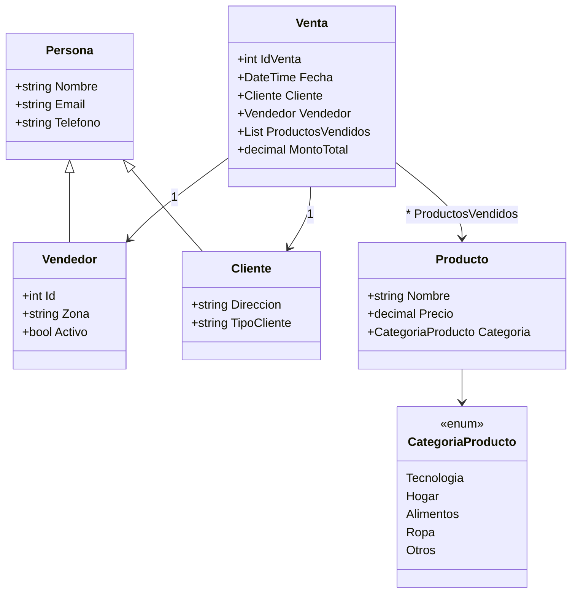
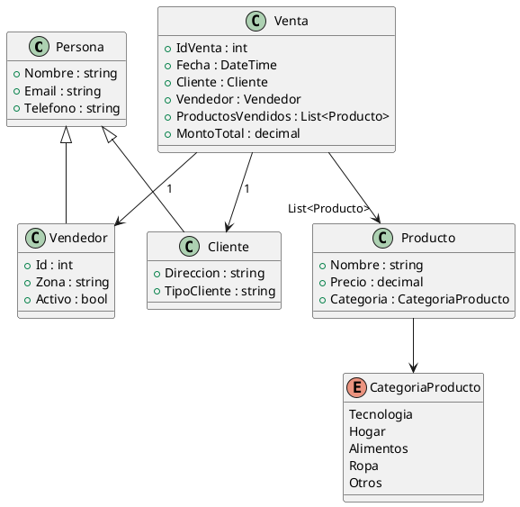

# 👨‍👩‍👦 Diagrama UML con Herencia – Sistema de Ventas

Este diagrama muestra cómo **Vendedor** y **Cliente** heredan de **Persona**, y cómo **Venta** se relaciona con **Cliente**, **Vendedor** y **Producto**. Además, **Producto** se clasifica con el `enum CategoriaProducto`.

---

## 🟢 Mermaid 

---

## 🔵 PlantUML

