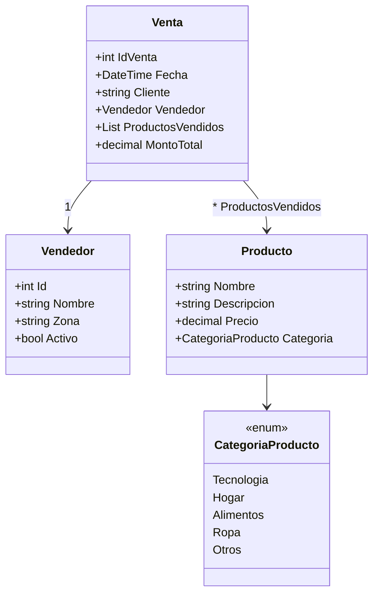

# 📘 Desarrollo básico por pasos: Sistema de Ventas (C#)

Este documento guía, paso a paso, la construcción de un ejemplo simple de **Sistema de Ventas** con C#. Incluye clases básicas, enum, creación de objetos y una impresión final en consola.

---

## 1) Creación de la clase `Vendedor`

Se define la clase con sus propiedades: `Id`, `Nombre`, `Zona`, `Activo`.  
Representa a la persona que realiza las ventas.

```csharp
class Vendedor
{
    public int Id;
    public string Nombre;
    public string Zona;
    public bool Activo;
}
```

---

## 2) Creación de la clase `Producto`

Se define la clase con propiedades: `Nombre`, `Descripcion`, `Precio`, `Categoria`.  
La propiedad `Categoria` usará un **enum**.

```csharp
class Producto
{
    public string Nombre;
    public string Descripcion;
    public decimal Precio;
    public CategoriaProducto Categoria;
}
```

---

## 3) Creación de la clase `Venta`

Se define la clase `Venta` con propiedades: `IdVenta`, `Fecha`, `Cliente`, `Vendedor`, `ProductosVendidos`, `MontoTotal`.

**Notas:**
- `Vendedor` es otro objeto de tipo `Vendedor`.
- `ProductosVendidos` es una **lista** de `Producto`.

```csharp
class Venta
{
    public int IdVenta;
    public DateTime Fecha;
    public string Cliente;
    public Vendedor Vendedor;
    public List<Producto> ProductosVendidos;
    public decimal MontoTotal;
}
```

---

## 4) Creación del `enum` `CategoriaProducto`

Sirve para clasificar productos dentro de categorías definidas. Se usa en la clase `Producto`.

```csharp
enum CategoriaProducto
{
    Tecnologia,
    Hogar,
    Alimentos,
    Ropa,
    Otros
}
```

---

## 5) Instanciación de **Productos**

Se crean productos específicos, asignando valores a sus propiedades.

```csharp
var laptop = new Producto
{
    Nombre = "Laptop Dell XPS",
    Descripcion = "Ultrabook 13"",
    Precio = 1200.50M,
    Categoria = CategoriaProducto.Tecnologia
};

var celular = new Producto
{
    Nombre = "iPhone 15",
    Descripcion = "Smartphone",
    Precio = 1500.00M,
    Categoria = CategoriaProducto.Tecnologia
};
```

---

## 6) Instanciación del **Vendedor**

Se crea un objeto `Vendedor` con sus propiedades asignadas.

```csharp
var vendedor = new Vendedor
{
    Id = 1,
    Nombre = "Carlos Pérez",
    Zona = "Ciudad Capital",
    Activo = true
};
```

---

## 7) Instanciación de las **Ventas**

Cada venta contiene:
- Un `IdVenta`.
- Una fecha (`DateTime.Now`).
- El nombre del cliente.
- El objeto `Vendedor`.
- Una lista de productos vendidos.
- El monto total.

```csharp
var venta1 = new Venta
{
    IdVenta = 1001,
    Fecha = DateTime.Now,
    Cliente = "Empresa ABC",
    Vendedor = vendedor,
    ProductosVendidos = new List<Producto> { laptop },
    MontoTotal = laptop.Precio
};

var venta2 = new Venta
{
    IdVenta = 1002,
    Fecha = DateTime.Now,
    Cliente = "Juan López",
    Vendedor = vendedor,
    ProductosVendidos = new List<Producto> { celular },
    MontoTotal = celular.Precio
};
```

---

## 8) Impresión de resultados en consola

Se muestran los datos principales de vendedor y ventas.

```csharp
Console.WriteLine($"Vendedor: {vendedor.Nombre}, Zona: {vendedor.Zona}");
Console.WriteLine($"Venta 1 -> Cliente: {venta1.Cliente}, Monto: {venta1.MontoTotal}, Producto: {venta1.ProductosVendidos[0].Nombre}");
Console.WriteLine($"Venta 2 -> Cliente: {venta2.Cliente}, Monto: {venta2.MontoTotal}, Producto: {venta2.ProductosVendidos[0].Nombre}");
```

---

## 📊 Diagrama de clases UML (Mermaid)

> Opcional para documentación en Notion/GitHub. Copia y pega este bloque para visualizar el diagrama.


