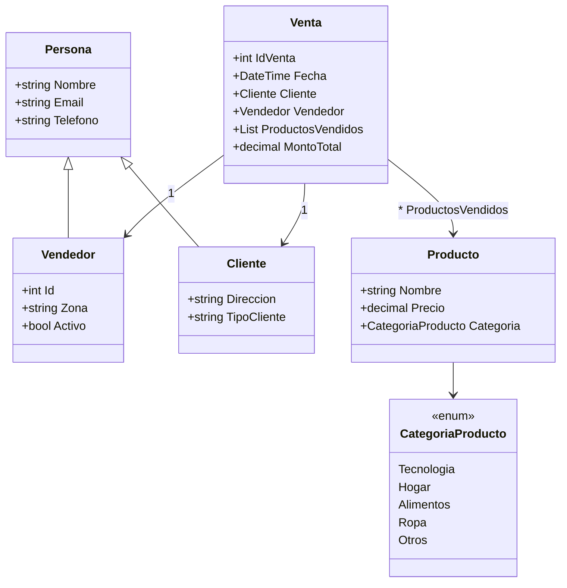
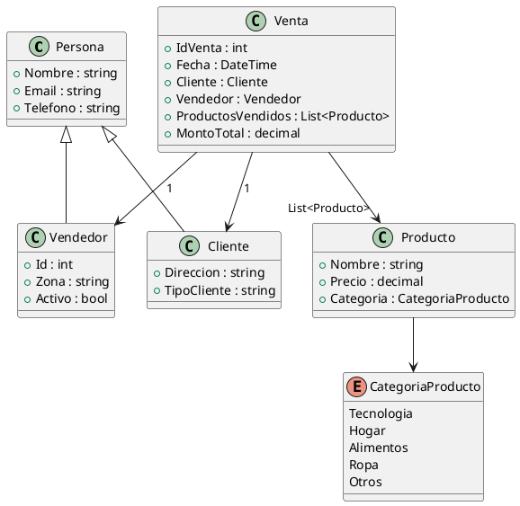

# 👨‍👩‍👦 Diagrama UML con Herencia – Sistema de Ventas

Este diagrama muestra cómo **Vendedor** y **Cliente** heredan de **Persona**, y cómo **Venta** se relaciona con **Cliente**, **Vendedor** y **Producto**. Además, **Producto** se clasifica con el `enum CategoriaProducto`.

---

## 🟢 Mermaid 

```mermaid
classDiagram
    class Persona {
        +string Nombre
        +string Email
        +string Telefono
    }

    class Vendedor {
        +int Id
        +string Zona
        +bool Activo
    }

    class Cliente {
        +string Direccion
        +string TipoCliente
    }

    class Producto {
        +string Nombre
        +decimal Precio
        +CategoriaProducto Categoria
    }

    class Venta {
        +int IdVenta
        +DateTime Fecha
        +Cliente Cliente
        +Vendedor Vendedor
        +List<Producto> ProductosVendidos
        +decimal MontoTotal
    }

    class CategoriaProducto {
        <<enum>>
        Tecnologia
        Hogar
        Alimentos
        Ropa
        Otros
    }

    Persona <|-- Vendedor
    Persona <|-- Cliente

    Venta --> Cliente : 1
    Venta --> Vendedor : 1
    Venta --> Producto : * ProductosVendidos
    Producto --> CategoriaProducto
```

---

## üîµ PlantUML

```plantuml
@startuml
class Persona {
    + Nombre : string
    + Email : string
    + Telefono : string
}

class Vendedor {
    + Id : int
    + Zona : string
    + Activo : bool
}

class Cliente {
    + Direccion : string
    + TipoCliente : string
}

class Producto {
    + Nombre : string
    + Precio : decimal
    + Categoria : CategoriaProducto
}

class Venta {
    + IdVenta : int
    + Fecha : DateTime
    + Cliente : Cliente
    + Vendedor : Vendedor
    + ProductosVendidos : List<Producto>
    + MontoTotal : decimal
}

enum CategoriaProducto {
    Tecnologia
    Hogar
    Alimentos
    Ropa
    Otros
}

Persona <|-- Vendedor
Persona <|-- Cliente

Venta --> Cliente : 1
Venta --> Vendedor : 1
Venta --> "List<Producto>" Producto
Producto --> CategoriaProducto
@enduml
```
